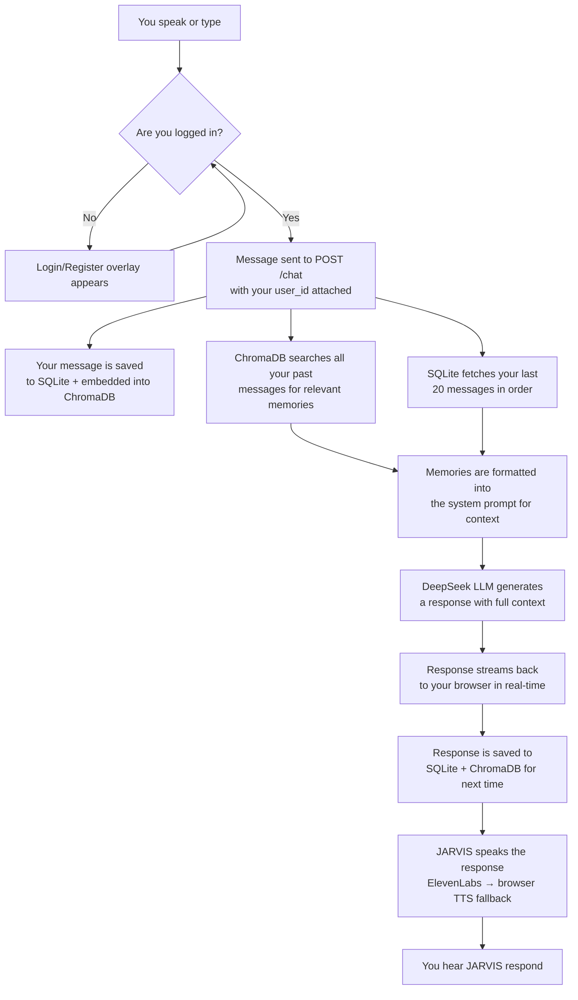

# JARVIS — Development Log

> *"Sometimes you gotta run before you can walk."* — Tony Stark
>
> A personal AI assistant with long-term memory, semantic retrieval, voice interaction, and a holographic UI. Built one late-night coding session at a time.

---

## Table of Contents

1. [The Idea](#the-idea)
2. [Phase 0 — Just Make It Work](#phase-0--just-make-it-work)
3. [Phase 1 — The "Keystone" Reality Check](#phase-1--the-keystone-reality-check)
4. [Phase 2 — Giving JARVIS a Brain](#phase-2--giving-jarvis-a-brain)
5. [How It All Fits Together](#how-it-all-fits-together)
6. [What's in the Box](#whats-in-the-box)
7. [The API at a Glance](#the-api-at-a-glance)
8. [Things That Keep Me Up at Night](#things-that-keep-me-up-at-night)
9. [Where We're Going Next](#where-were-going-next)

---

## The Idea

I wanted a JARVIS. Not a chatbot. Not a wrapper around ChatGPT with a fancy skin. I wanted something that *remembers*.

Here's the problem with every AI assistant I've used: they have amnesia. You tell them your name, your projects, your preferences — and five minutes later, it's gone. They live entirely in the moment, like that guy from Memento, except less charming and with worse UI.

So the plan was simple on paper:

1. Build a sci-fi HUD that looks like it belongs in Tony Stark's lab
2. Give it a proper British butler personality (because if you're going to build an AI assistant, it might as well have some class)
3. **Actually remember things** — not just the last 10 messages in a context window, but real, searchable, semantic memory that persists across sessions
4. Make it talk, listen, and look good doing it

The stack decision came down to pragmatism. Python + FastAPI on the backend because it's battle-tested and I can ship features fast. DeepSeek as the LLM because the API is OpenAI-compatible and the pricing doesn't require venture capital. Vanilla HTML/CSS/JS for the frontend because — and I cannot stress this enough — I did not want to spend three days configuring a JavaScript build pipeline for what is essentially a chat box with a pretty ring animation.

---

## Phase 0 — Just Make It Work

**When:** Around June 2026

**The goal:** Get from zero to "I can talk to it and it talks back" in the shortest time possible. No memory system, no auth, no clever architecture. Just a pipe from microphone → LLM → speaker with a cool UI wrapped around it.

### What Got Built

The backend came together quickly. FastAPI on port 8000, a single `/chat` endpoint streaming responses from DeepSeek, a `/tts` endpoint hitting ElevenLabs with the George voice (British, naturally), and a `/system_stats` endpoint for CPU and RAM telemetry because what's a HUD without some fake-looking system metrics?

The AI layer was equally straightforward — an OpenAI-compatible client pointed at DeepSeek's `deepseek-chat` model. Two functions: one for sync chat, one for SSE streaming. The system prompt got the JARVIS personality baked in: one-sentence replies, dry wit, British formality. A `[LOCATION: ...]` parser that triggers a Google Maps embed when the AI mentions a place. A `research_jarvis()` function for structured mind-map data.

The database was... well, it was a single SQLite table called `memory`. Two functions: `save_message(role, content)` and `get_history(limit=10)`. I called it "memory" but really it was just a log file. More on that later.

The HUD was where I spent the most time, and honestly where the project found its personality. Single-file `index.html` — no React, no Vue, no `node_modules` directory with 40,000 files. Just raw HTML, CSS, and JavaScript doing things that frameworks usually handle. The ring animation is a Canvas element with multiple concentric circles rotating at different speeds. There's a 3D holographic cylinder made of particles. A clock in the corner with the Orbitron font. Network, CPU, and RAM stats that update every 2.5 seconds. It's gloriously over-the-top in the best way.

The overlay system was the smartest UX decision I made early on. Instead of page navigation, everything slides in as a modal overlay — System Monitor, Full Chat, Map, Terminal, Research. It keeps you in the HUD at all times. The map overlay was a nice touch: if JARVIS mentions a location in `[LOCATION: tags]`, Google Maps slides in centered on that spot.

Voice was the hardest part of Phase 0. The browser's `SpeechRecognition` API is... temperamental. It stops listening randomly. It mishears things. It requires HTTPS or localhost. I built an auto-retry loop (up to 10 retries) with visual state indicators — the mic icon shows muted, listening, or thinking. For TTS, ElevenLabs is the primary (George voice, `eleven_turbo_v2`), with a browser `speechSynthesis` fallback that does a passable British accent. I also wired up gTTS as a middle tier, but that turned out to be a mistake we'll get to later.

By the end of Phase 0, I had something that *felt* like JARVIS. You could talk to it, it would respond in a British accent, and the HUD looked incredible. But it had the memory of a goldfish.

---

## Phase 1 — The "Keystone" Reality Check

**When:** Late June 2026

I wrote down seven "keystone goals" — the things that would make JARVIS a real AI companion rather than a pretty voice interface:

1. Long-term data storage
2. SentenceTransformers for language understanding
3. AI retrieval system (pulling relevant memories into conversations)
4. Vector database (for the retrieval system to search)
5. AI reasoning layer (the LLM brain)
6. User layer (the HUD)
7. System orchestration (the backend tying it together)

I checked off all seven and called Phase 1 complete. Then I actually looked at the code.

Here's what I actually had:

| What I Said | What I Had | Honest Assessment |
|---|---|---|
| SentenceTransformers | Not installed, not imported, not used anywhere | Just... didn't exist yet |
| Vector database | No ChromaDB, no FAISS, no Pinecone | Not even on the radar |
| AI retrieval system | `get_history()` returning the last 10 raw messages | That's not retrieval, that's a scrollback buffer |
| SQLite storage | Two duplicate files (`database.py` and `memory.py`) both doing the same thing | I'd copy-pasted my own code and forgotten about it |

So Phase 1 was actually 4/7, not 7/7. The three missing pieces were all in the same category: **semantic memory**. I had built a voice assistant with a chat log. What I wanted was a companion with actual recall.

This sounds like a failure but honestly it was the most productive thing that could have happened. I'd built the hard parts — the HUD, the voice pipeline, the LLM integration — and now I knew *exactly* what was missing. No ambiguity. Just three concrete things: install SentenceTransformers, set up ChromaDB, and build a retrieval pipeline.

---

## Phase 2 — Giving JARVIS a Brain

**When:** July 1, 2026

This was the phase where JARVIS went from "impressive demo" to "actually useful." The plan was four things: semantic memory, vector search, memory injection into every LLM call, and user accounts so different people could have their own memory spaces.

### Picking the Right Tools

Every architecture decision here was about minimizing friction while maximizing capability:

**SentenceTransformers with `all-MiniLM-L6-v2`** is the unsung hero of this project. It's 80 megabytes. It runs on CPU. It produces 384-dimensional vectors in about 10-30 milliseconds. When your LLM is taking 1-3 seconds to respond, the embedding cost is invisible. And because it runs locally, there's no API bill, no rate limits, no "sorry, our embedding service is down." It just works.

**ChromaDB** was the obvious vector database choice because it embeds SQLite internally. When you're already using SQLite for everything else, adding another SQLite-based system means zero new infrastructure. No Docker containers, no cloud services, no connection strings. Just a `chroma_data/` directory that appears next to your `jarvis.db`. The HNSW index gives you sub-millisecond similarity search over tens of thousands of vectors.

**bcrypt** for passwords because it's been the standard for twenty years and there's no reason to get clever with auth on a local-first app. No JWT overhead, no OAuth flows, no "sign in with Google." Just username + password, hashed properly, stored in SQLite.

The **dual-write pattern** (every message goes to both SQLite and ChromaDB) was the key design decision. SQLite handles structured stuff — "show me the last 20 messages," "how many messages has this user sent" — while ChromaDB handles "what past conversations are relevant to what the user just said?" Both write on every message. Both are queried on every chat. The overhead is negligible and the separation of concerns is clean.

### What Actually Changed

The biggest change was a new file: `storage.py`. Before this, the data layer was split across two duplicate files (`database.py` and `memory.py`) that both did the same basic thing. `storage.py` consolidated everything into one module with a clear shape:

```
storage.py
├── SQLite side
│   ├── users table     — id, username, bcrypt-hashed password, created_at
│   └── messages table  — id, user_id (FK), role, content, timestamp
│
├── ChromaDB side
│   └── jarvis_messages collection  — 384-dim cosine vectors, HNSW indexed
│
├── Embeddings
│   └── SentenceTransformer singleton  — lazy-loaded, runs on CPU
│
├── User management
│   ├── create_user()        — bcrypt hash, enforce min lengths
│   └── authenticate_user()  — bcrypt verify
│
├── Message persistence
│   ├── save_message()   — dual-write to SQLite + ChromaDB
│   └── get_history()    — chronological, per-user, configurable limit
│
└── Semantic memory
    ├── retrieve_memories()      — cosine similarity search via ChromaDB
    ├── search_memories()        — alias for the API
    └── get_user_message_count() — simple stats
```

The SentenceTransformer model loads once as a singleton — the first call takes a moment, every call after is instant. `init_db()` runs on import and is fully idempotent, so you can restart the server as many times as you want without worrying about schema migrations.

### Teaching the AI to Use Its Memories

`ai.py` got a new function called `_build_system_prompt()`. Here's what it does:

When memories come back from ChromaDB, they get formatted into the system prompt like this:

```
=== RELEVANT PAST MEMORIES (use these if they help answer the user) ===
[MEMORY 1 — 2026-07-01] My name is Bruce and I love building AI assistants
[MEMORY 2 — 2026-06-30] I prefer short answers and hate small talk
```

The LLM sees these before it sees the user's message. It treats them like context it "knows" about the person it's talking to. The result is that JARVIS doesn't just respond to what you said — it responds to *who you are*.

Both `ask_jarvis()` and `ask_jarvis_stream()` now accept optional `user_id` and `memories` parameters. If you don't pass them, everything still works exactly like it did before. Backward compatibility was non-negotiable.

### The Chat Endpoint Got Smarter

Before Phase 2, the `/chat` flow was:

```
User message → get last 10 messages → save user message → LLM → save response → stream back
```

After Phase 2:

```
User message → semantic search (top 5 relevant memories) → get last 20 messages →
save user message → LLM (with memories injected into system prompt) → save response → stream back
```

Two new steps — semantic search and memory injection — and they happen in parallel with the history fetch. The latency impact is essentially zero because the embedding + ChromaDB query completes in under 50ms.

### User Accounts, Finally

The auth system is deliberately simple. Two endpoints: `/auth/register` and `/auth/login`. Both take a username and password, both return `{id, username}`. Passwords are bcrypt-hashed before they touch the database. No sessions, no tokens — the frontend stores the user ID in `localStorage` and sends it with every request.

Is this production-grade auth? No. Is it fine for a personal assistant running on localhost? Absolutely. JWT tokens are on the roadmap for Phase 4 when this thing might actually face a network.

The frontend got a login overlay — dark card, tab switching between LOG IN and REGISTER, error states for wrong passwords or duplicate usernames. The HUD doesn't appear until you're authenticated. On page reload, it reads from `localStorage` and verifies the user still exists with a quick `/user/{id}/stats` call.

### The Moment of Truth: Testing

I wrote a test script that walked through the entire pipeline:

1. Register a user → got back `{id: 1, username: "testuser"}`
2. Tell JARVIS "My name is Bruce and I love building AI assistants" → JARVIS responded with its usual British sass
3. Ask "What is my name and what do I enjoy building?" → JARVIS said: *"Your name is Bruce, sir, and you enjoy building AI assistants — though I daresay none quite as polished as myself."*
4. Run a semantic search for "AI assistants" → three results came back with relevance scores of 0.667, 0.639, and 0.468 — all pointing to the right messages
5. Check user stats → 4 messages stored

It worked. JARVIS remembered who Bruce was across conversation turns. The memory pipeline — embedding → storage → retrieval → injection → recall — was complete.

That moment when the AI says your name back to you after you told it five minutes ago? That's the whole point of this project. Stateless chatbots can't do that.

---

## How It All Fits Together

Here's the full data flow when you say something to JARVIS:



### The Project Layout

```
jarvis/
├── .env                    # Your API keys live here (never commit this)
├── .venv/                  # Python virtual environment — keeps dependencies sane
├── main.py                 # The FastAPI server — every endpoint is defined here
├── ai.py                   # DeepSeek integration — the British butler personality
├── storage.py              # The memory brain — SQLite + ChromaDB + embeddings
├── database.py             # Old storage code — kept for reference, not used anymore
├── memory.py               # Old duplicate code — also not used anymore
├── requirements.txt        # What you need to pip install
├── Dockerfile              # Container setup for deployment
├── runtime.txt             # Platform specification
├── README.md               # Quick-start guide
├── DEVLOG.md               # You're reading it
├── jarvis.db               # SQLite database (created automatically on first run)
├── chroma_data/            # ChromaDB vector store (created automatically on first run)
└── static/
    └── index.html          # The entire frontend in one file (~2,000 lines of glory)
```

### The Tech Stack, Explained Like a Human

**Python 3.13 + FastAPI** is the server. FastAPI was chosen because it has native async support, automatic OpenAPI docs, and SSE streaming that actually works without fighting the framework. Coming from Flask, the developer experience is night and day.

**DeepSeek** (`deepseek-chat`) is the reasoning engine. It's accessed through an OpenAI-compatible client, which means switching to another provider later is basically changing one URL and one model name. Temperature is set to 0.3 — enough for the JARVIS personality to shine through, not so much that it hallucinates your name.

**SentenceTransformers** (`all-MiniLM-L6-v2`) is what turns text into math that computers can compare. It's small enough to run on a laptop CPU, fast enough that you never notice it, and accurate enough that the semantic search feels like magic. 384 numbers per message, and messages with similar meaning end up close together in that 384-dimensional space.

**ChromaDB** stores those 384-dimensional vectors and lets you search them by cosine similarity. Under the hood it's using HNSW graphs, which is a fancy way of saying "it finds the nearest vectors really fast without checking every single one." All data lives in a `chroma_data/` directory — no separate server, no configuration, just files on disk.

**SQLite** handles everything ChromaDB doesn't: user accounts, message ordering, counting, filtering by user ID. It's the source of truth for structured data, while ChromaDB is the source of truth for meaning.

**bcrypt** hashes passwords. That's all it does, and it does it well. Your password never touches disk in plaintext.

**Vanilla HTML/CSS/JS** is the frontend. No React, no build step, no `node_modules`. The entire UI — HUD, ring animation, holographic cylinders, chat overlay, map overlay, mind-map engine, voice controls — lives in one file. This was a deliberate choice. For a personal project, frameworks add complexity without adding value. The HUD renders at 60fps, the Canvas animations are smooth, and the SSE streaming works perfectly. What more do you need?

**ElevenLabs** provides the voice. George is a British male voice that sounds appropriately butler-like. The `eleven_turbo_v2` model gives low-latency streaming. If ElevenLabs is down, the browser's built-in `speechSynthesis` does a surprisingly decent British accent. There was supposed to be a gTTS middle tier, but...

---

## Things That Keep Me Up at Night

### 1. The gTLS / Click Drama

`sentence-transformers` requires `click` version 8.4 or higher. `gTTS` requires `click` version 8.2 or lower. These two packages cannot coexist peacefully. I chose to keep `click` at 8.4 for the embedding pipeline and accept that gTTS might break. In practice, this means the TTS fallback chain skips straight from ElevenLabs to the browser's speech synthesis. For a personal project, this is fine. For production, someone needs to yell at the gTTS maintainers.

### 2. Python Environment Chaos

This machine has two Python installations: a Windows Store version and a standalone Python 3.13. Pip was installing to one while `python` was running the other. The fix was creating a `.venv` in the project directory. Always run with `.\.venv\Scripts\python.exe`. Always.

### 3. Auth Is Trust-Based Right Now

There are no session tokens, no JWTs, no expiration. The frontend stores your user ID in `localStorage` and sends it with every request. The server trusts it. This is fine on `localhost` where you're the only user and you're not exposing ports to the internet. It would be a disaster on a public network. Phase 4 will add proper token auth.

### 4. The Embedding Model Downloads on First Run

The first time `storage.py` is imported, SentenceTransformers reaches out to HuggingFace and downloads `all-MiniLM-L6-v2`. It's about 80 megabytes. On a fast connection it takes seconds. On a slow connection... make some tea. This only happens once.

### 5. Messages Are Stored Raw

Whatever you type goes directly into SQLite and ChromaDB. There's no input sanitization, no XSS filtering, no content moderation. If you paste a `<script>` tag into the chat, it'll get stored and potentially rendered. For a personal assistant, this is a non-issue. If this ever becomes multi-tenant, it needs fixing.

### 6. The Old Files Are Still Lying Around

`database.py` and `memory.py` are both dead code. They're not imported anywhere. They exist as historical artifacts, like scaffolding left up after a building is finished. I'll remove them when I'm absolutely sure nothing references them.

---

## Where We're Going Next

### Phase 3 — JARVIS Takes Action

Right now JARVIS can remember things. Next, it should be able to *do* things. DeepSeek supports function calling, which means JARVIS could set reminders, send emails, search the web, or control smart home devices. The big items:

- **Function calling** — give JARVIS tools and let it decide when to use them
- **Fact extraction** — automatically pull out key facts from conversations (names, preferences, projects) and store them as structured knowledge
- **Web search** — DuckDuckGo or SerpAPI integration so JARVIS can look things up
- **Scheduled tasks** — daily summaries, reminders, proactive check-ins

### Phase 4 — Growing Up

Before this thing ever sees a network, it needs:

- **JWT authentication** — real sessions with expiration
- **Structured logging** — probably Loguru, so debugging isn't `print()` statements
- **Configuration management** — move hardcoded values to a config file
- **Conversation summarization** — compress old conversations so the context window doesn't overflow
- **Input sanitization** — don't let users inject HTML into the HUD
- **Rate limiting** — don't let anyone hammer the DeepSeek API

### Phase 5 — Polish

The HUD works great on a desktop monitor. It's not responsive. It doesn't work on mobile. There's one theme. The layout is fixed. Phase 5 is about making it feel like a polished product:

- Responsive design for tablets and phones
- Theme support (dark mode is already there, but a light mode would be nice)
- Customizable HUD layout
- Notification system
- File upload and image recognition
- Voice command customization

---

*Last updated: July 1, 2026 — End of Phase 2. JARVIS now remembers.*
